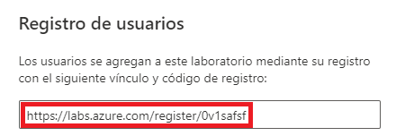
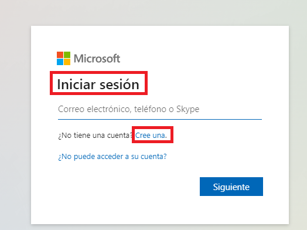
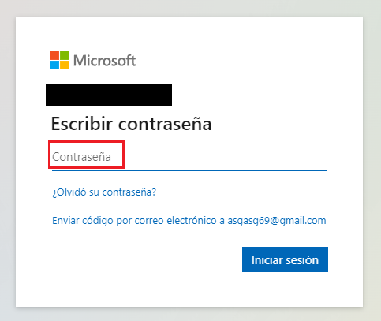
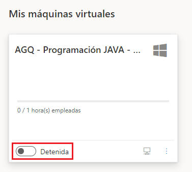

# AccesoAlumnosAzureLabs

El ***administrador*** de los laboratorios o el ***profesor*** del curso hará llegar al alummo un ***link*** para acceder al laboratorio. Este link es de la forma siguiente:

El alumno deberá copiar el link y pegarlo en la ***barra de direcciones*** de su navegador, con la intención de ***registrarse*** en el laboratorio. Una vez hecho, Azure pedirá al usuario que se autentique con una credencial.

Puedes autenticarte con tu cuenta de Microsoft ***Corporativa*** o ***personal***, o con los proveedores de autenticación para los cuales Microsoft haya creado confianzas, como ***Google***, ***Twitter***, etc. También puedes crearte una cuenta gratuita si no quieres usar ninguna de las anteriores.

A continuación introduce la ***contraseña***.

Se te dará la bienvenida a los servicios de Azure Labs y se ***procederá a tu registro***.

La VM aparecerá ***detenida***, así que haz clic en el pestillo para iniciarla.
(Nota: El laboratorio tiene asignadas unas horas de inicio y de finalización, por lo que habitualmente no tendrás que iniciar ni apagar tu VM, ya que se hace automáticamente. De forma general, la VM se inicia ***5 minutos*** antes del inicio de la clase y se apagará ***10 minutos*** después de que ésta finalice)

Cuando la máquina virtual esté iniciada, se activará el icono de acceso remoto (***RDP*** para VM de Windows y ***SSH*** para las de Linux). Haciendo clic en dicho icono podrás conectar con la VM.

Importante. El link de activación es común para el grupo y se contabiliza una activación por cada registro. Si algún alumno se registra más de una vez, quitará una instancia a otro compañero. Si esto ocurriese u hubiese alguna duda, preguntar al profesor.

Importante. Las credenciales de acceso a la VM te la proporcionará el profesor al iniciar la formación.

Disfruta de la formación.
